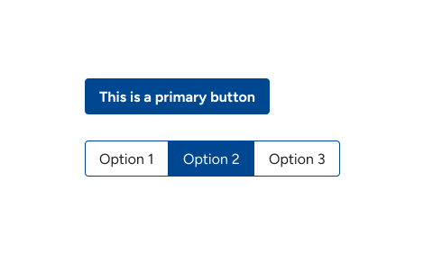
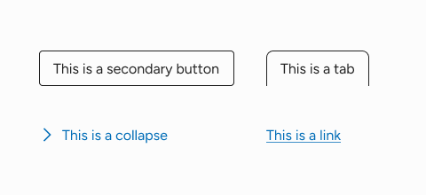
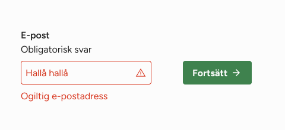
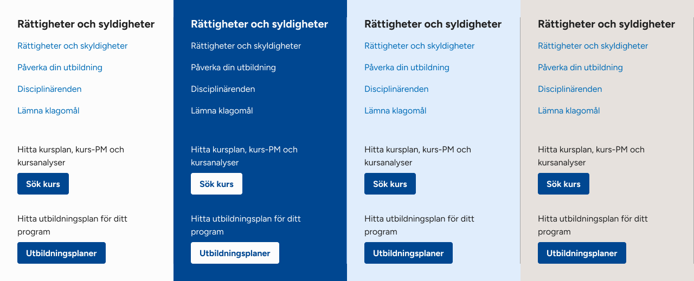

# Colors

Color system in KTH Style is based on KTH graphical identity and implements accessible contrast requirements by default.

- All available colors are defined as Sass variables (reference tokens) and CSS custom properties (semantic tokens).
- You should not use reference tokens if there is a semantic token available.
- Different semantic tokens in some themes can be the same color. For example, `--background-color` and `--primary-on-color` are both "white" in default theme.
- Different themes define different values for semantic token. Default theme defines `--text-color` as black, but theme inverse defines `--text-color` as white.

## Brand colors (reference tokens)

<details>
<summary>This section is under development</summary>


</details>

## Semantic colors (semantic tokens)

Colors are grouped by semantics in the following categories:

- Surface colors
- Primary colors
- Secondary colors

### Surface colors

Used for large surfaces like a header or the whole page. They are:

- `--background-color`. Color for the background of the surface
- `--text-color`. Color for texts that are directly written on the surface

### Primary colors

Used for UI components with a "primary" appearance:



- `--primary-color`. Main color of the component. For example the background of a button
- `--primary-on-color`. Color for elements _inside_ the component. For example texts and icons of a button

### Secondary colors

Used for UI elements with a "secondary" appearance:



- `--boxed-secondary-color`. Main color for secondary components with borders. For border, texts and icons
- `--unboxed-secondary-color`. Main color for secondary components without borders. For texts and icons

Accessibility: UI components that use `--unboxed-secondary-color` **must** have extra elements to indicate they are interactive. For example:

- Specific position: a link positioned inside a navigation area
- A decoration: an underlined link
- Extra elements: icons for collappse and dropdowns

### Success and error

Used to indicate success and error.



- `--error-color`. Color for errors. Used in borders, texts and backgrounds of UI elements
- `--success-color`. Color for success. Used in borders, texts and backgrounds of UI elements

Accessibility: UI components should not rely only on color to convey error or success meaning. Use icons, labels and other additional elements

## Other colors

<details>
<summary>We are still working on colors for other stuff</summary>

We are still working on colors for:

- **Separators**. We are testing how different colors look like with different backgrounds
- **Shadows and backdrops**. This might be a single variable that defines entire properties (like the entire value for `box-shadow`)
</details>

## Hover state

<details>
<summary>We are working on colors for hover</summary>

We think it is possible to define just one "overlay" color (something like a black with 10% opacity) and "merge" both the normal color with CSS:

```scss
// --hover-overlay transparent by default:
button.primary {
  background: var(--primary-color), var(--hover-overlay, transparent);
}

button.secondary {
  background: var(--hover-overlay);
}

// We don't need to style every hover component. Just need to set the value for the overlay and components will read the value
:hover {
  --hover-overlay: rgb(0 0 0 / 0.1);
}
```

</details>

## Active states

Some components need to signal an "active" or "inactive" states:

- Checkboxes and radio buttons when they are checked
- A dropdown when its opened
- A menu item when the link refers to the current page
- Selected and unselected tab

We haven't found yet any clear pattern nor a set of colors that signals "active" universally. Specific components might need special colors designed exclusively for them.

## Contexts (themes)



KTH Style defines the following 4 color themes:

- `theme-color-default`.
- `theme-color-inverse`. For the header in kth external web
- `theme-color-intranet`. For the header in intranet
- `theme-color-student`. For the header in student web

Use the mixins with the same name to switch between themes.

## Accessibility

All colors in a given theme must met the WCAG contrast requirements for the purpose that are designed for. Example:

- `--background-color` and `--text-color` should have as highest contrast as possible since they are colors for background and normal text. At least 7:1 is desired
- `--background-color` should have contrast with `--primary-color`, `--error-color` and `--success-color` (all of the three) of at least 4.5:1 since the latter three appear always on the background.
- `--primary-on-color` should have contrast with `--primary-color`, `--error-color` and `--success-color` (all of the three) of at least 4.5:1
- `--boxed-secondary-color` should have 4.5:1 contrast with `--background-color`
- `--unboxed-secondary-color` should have 4.5:1 contrast with `--bacakground-color`. It is recommended to have a 3:1 contrast with `--text-color`.

## Usage notes

Different semantic tokens in some themes can be the same color. For example, `--background-color` and `--primary-on-color` are both "white" in default theme.

However, they should not be used interchangeably because they might be different in different themes or in future available contexts.
