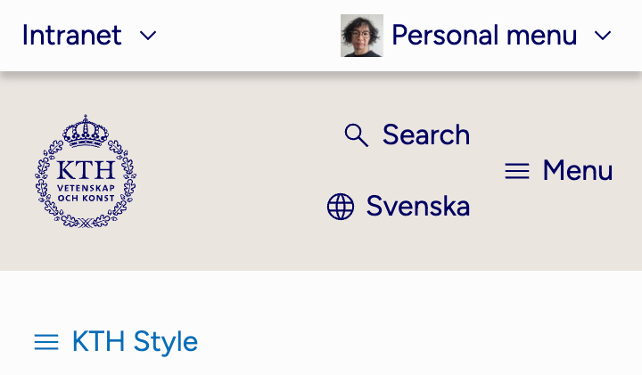
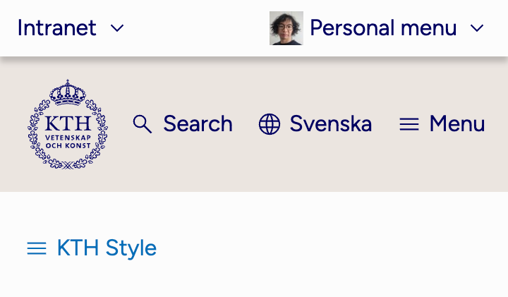
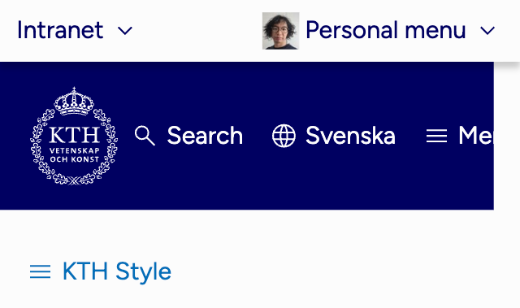
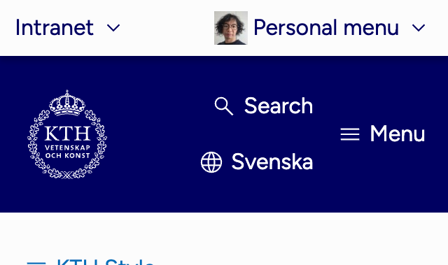
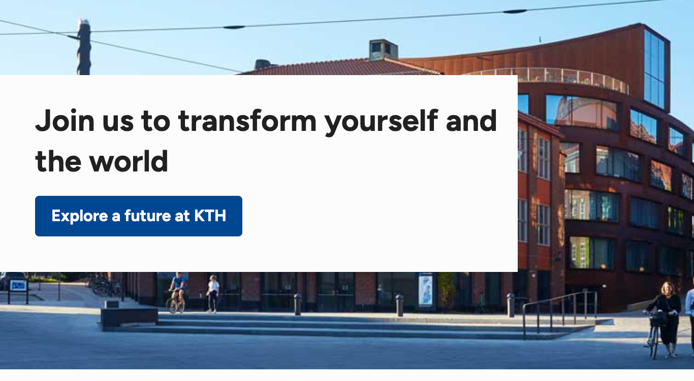
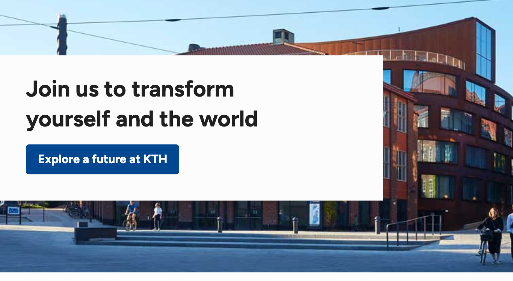

# Screen resolution and browser support

Read what browsers and devices are supported by KTH Style and which ones should you support

## General ideas

As a principle: avoid negative impact to all users; prefer to give the best experience to users with modern browsers and most used devices

When writing code or designing, make a decision based on the negative impact for users:

1. Accessibility or major usability issues. For example, a button is unusable or users cannot perform a task.

   You should minimize this, especially if it causes failures in accessibility guidelines

2. Minor usability or aesthetic issues (users can use the app but it might not _look_ great). For example: an image is misaligned.

   It is ok if some users perceive defects. Avoid polyfills or "hacks" to increase support

## Screen resolution

1. Layouts should be designed (should "look good") for screen widths between 360px and 1280px

   - This value is based on [KTH analytics](https://analytics.sys.kth.se/).
   - These values can be different in some scenarios. E.g.: apps for administration are often accessed with computers with mouse and keyboard inputs.

2. In addition, no accessibility or major usability issues should be present in screen widths between 320px to 360px but it is ok that things don't look good.

   - In particular, content (except bi-dimensional objects like tables, diagrams and maps) should be visible without horizontal scrolling in screen widths from 320px and 1280px, according to [Success Criteria 1.4.10 Reflow (AA) in WCAG 2.1 guidelines](https://www.w3.org/WAI/WCAG21/Understanding/reflow).
   - Remember to test _all_ screen sizes from 320px to 1280px, not only the minimum and maximum

### Example: header at KTH in resolutions 360px and above

The header should look good for resolutions above 360px.

<figure>

<figcaption>Don't: menu looks ugly ("Search" on top of "Svenska")in devices with width 360px</figcaption>
</figure>

Logotype's margin is adjusted:

<figure>

<figcaption>Do: menu items in looks good ("Search", "Svenska" and "Menu" aligned properly</figcaption>
</figure>

### Example: header at KTH in resolutions between 320px and 360px

The header should not present accessibility issues between 320px and 360.

<figure>

<figcaption>Don't: the "Menu" button leaks outside of the background which causes contrast issues</figcaption>
</figure>

The property `flex-wrap` is added to avoid horizontal scrolling:

<figure>

<figcaption>Do: the "Menu" does not leak outside of the dark container</figcaption>
</figure>

## Browser support

1. Use always features supported in all stable versions of core browsers (as defined below).
2. Do not use features marked as [experimental, deprecated or obsolete by MDN](https://developer.mozilla.org/en-US/docs/MDN/Writing_guidelines/Experimental_deprecated_obsolete). For example, do not use [`virtualkeyboardpolicy`](https://developer.mozilla.org/en-US/docs/Web/HTML/Global_attributes/virtualkeyboardpolicy)
3. No accessibility nor major usability issues should be present for users using a browser that is less than 24 months old
4. It is ok to offer a slightly degraded experience for users that have browsers older than 6 months (see example).

   Avoid using polyfills or "hacks" to force an optimal experience to all users

Core browsers, at the time of writing, are:

- Chrome for desktop
- Firefox for desktop
- Safari for desktop
- Edge for desktop
- Chrome for Android
- Firefox for Android
- Safari for iOS

The values in this section (including the definition of core browsers) are based on

- Usage data collected in [KTH analytics](https://analytics.sys.kth.se)
- The Web Platform Baseline initiative described below

### Example. `text-wrap: balance`

There is a new CSS feature called `text-wrap: balance`. When added to a header, for example a hero, the text becomes balanced:

<figure>

<figcaption>Without "text-wrap", the two rows of text in the hero are "Join us to transform yourself and" and "the world"</figcaption>
</figure>

<figure>

<figcaption>With "text-wrap", the two rows of text in the hero are "Join us to transform" and "yourself and the world" making both rows more balanced</figcaption>
</figure>

Should `text-wrap` be used in this case?

- Is this feature experimental, deprecated or obsolete? No
- Is this feature supported in all core browsers? Yes
- From which date is `text-wrap` supported by all core browsers: latest browser to release this feature was Firefox on 2024-03-19, around 3 months ago (at the time of writing)
- What are the negative consequences for users using older browsers: they see an unbalanced text.

In this case, the negative consequences are not accessibility or usability problems, so it is OK to use it.

## Web Platform Baseline

[Baseline](https://web.dev/baseline) is an project created by the [Web DX Community Group](https://www.w3.org/blog/2022/webdx-improving-the-experience-for-web-developers/) in collaboration with major browser vendors (Apple, Google, Microsoft and Mozilla). It classifies features in two stages:

- **Newly available** means a feature supported by all core browsers
- **Widely available** means a feature is supported by all core browsers since at least 30 months.

Baseline information is displayed for example in [some pages on MDN](https://developer.mozilla.org/en-US/docs/Web/JavaScript/Reference/Statements/async_function) and even in [caniuse.com](https://caniuse.com/css-grid)

## Further reading

- [Defensive CSS: tips to build "safe" interfaces](https://defensivecss.dev/)
- [Interop 2022: browsers working together to improve the web for developers](https://web.dev/blog/interop-2022)
- [Web platform tests: Interop 2024](https://wpt.fyi/interop-2024)
