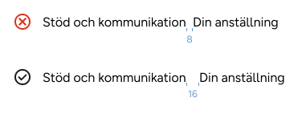
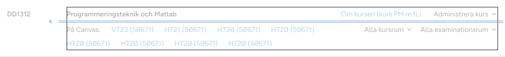

# Spacing

Spacing system in KTH Style is based on a 8px grid and helps to add hierarchy between UI elements

## Spacing system

In this documentation, we use `1/16 rem` as unit. For example, a padding value of `8` means `8/16 rem` or `0.5rem`

<details>
<summary>Why?</summary>

- Why `rem` instead of `px`? It is important that font size and measurements (widths, heights, paddings) keep the same proportions for accessibility and usability reasons. CSS pixel is not proportional to base font size if the user changes their settings.
- Why `1/16`? It is equivalent to 1 CSS pixel by default in all major browsers
</details>

KTH Style spacing scale is based on [Atlassian](https://atlassian.design) design system and defines 14 different spacing values.

- Small values: 0, 2, 4, 6 and 8
- Medium values: 12, 16, 20 and 24
- Large values: 32, 40, 48, 64 and 80

> [!Note]
> The scale is not linear but exponential. Smaller values increment by 2 and larger ones increment by 8 and even 16

All values in the scale are defined as reference tokens.

### Spacing within a component

KTH Style defines two semantic tokens for spacing inside a component.

- `--space-inner-inline` for inner padding in the inline axis (horizontal)
- `--space-inner-block` for inner padding in the block axis (vertical)
- `--space-inner-icon` for inner padding in both axis when the content is only an icon

Those tokens ensure components can be placed next to each other and have consistent sizing

### Spacing between components

KTH Style offers reference tokens to add spacing between UI elements. For example:

```scss
@use "@kth/style/scss/tokens/spacing";

.list {
  gap: spacing.$space-4;
}
```

## Contexts (themes)

KTH Style defines two spacing themes:

- `theme-spacing-default`
- `theme-spacing-compact` for "compact" interfaces like the personal menu or a dense table

## How to add padding in a new component

> [!Note]
> KTH Style components have these constrains already built-in

Components with correct inner padding values have a consistent size, which makes it easier to align them.

### Block axis padding

- Use `--space-inner-icon` if the component has only an icon (like the "star" button in the example below)
- Use `--space-inner-block` for everything else
- Substract the border from the padding (like in the button "Avbryt")


```scss
button.godkann {
  padding-block: var(--space-inner-block);
}

button.avbryt {
  border-width: $border-1;
  padding-block: calc(var(--space-inner-block) - $border-1);
}

button.english {
  padding-block: var(--space-inner-block);
}

button.star {
  padding-block: var(--space-innere-icon);
}
```

### Inline axis padding

- Use `--space-inner-icon` if the component has only an icon (like the "star" button in the example). Add a negative margin to align the visual area without shrinking the click area
- Use 0 if the component has no borders nor backgrounds (like the "English" button)
- Use `--space-inner-inline` for everything else (like the "Avbryt" and the "Godkänn" buttons)
- (Optional) Substract the border from the padding (like the "Avbryt" button)


```scss
button.godkann {
  padding-inline: var(--space-inner-inline);
}

button.avbryt {
  // Substracting the border here is optional
  border-width: $border-1;
  padding-inline: calc(var(--space-inner-inline) - $border-1);
}

button.english {
  padding-inline: 0;
}

button.star {
  padding-inline: var(--space-inner-icon);
  margin-inline: calc(-1 * var(--space-inner-icon));
}
```

## How to add space between components

### Design tips

#### Minimum spacing between elements

Make sure that there is enough space to avoid confusion with a "white-space" character.

- Use at least 16 between texts **in the inline axis**. 4 or even 0 is enough in the block axis.
- For everything else, there is no minimum space.




#### Use spacing to group elements by semantic proximity

- Related elements need smaller space between them
- Less related elements need bigger spacing


### Practical example on how to add spaces

1. Add space inside components

   

2. Start adding space in small groups, usually deeper in the DOM tree. 16-24 in the inline axis and 0-4 in the block axis is usually enough

   

3. Add bigger spacing between groups of groups.

   Tip: use `margin: auto` in flex aliged elements to get maximum margin

   

4. Continue adding spacing to bigger groups

   

5. There is no need for big spacing if there are other visual clues, like a big space below the "course code" in this image:

   

### Tips for developers

> [!Note]
> This section involves layout. It'll be moved to a specific page when ready

#### Use CSS `gap` in grid and flexbox layouts

- `gap` is applied only between elements, so you don't need to substract margin nor padding in elements that are in the edges of the container
- `gap` allows two values, one for each axis.

#### Add `flex-wrap` as defensive CSS

Use `flex-wrap: wrap` in lists to allow elements to span to multiple lines. Remember to adjust gap in both axes.

> [!Note]
> This is a "defensive" measurement. You should not _design specifically for the rare cases_, but you can make sure _the rare cases don't look broken_

## Further guidance

Consult KTH Style group in case you have different spacing/layout needs.
